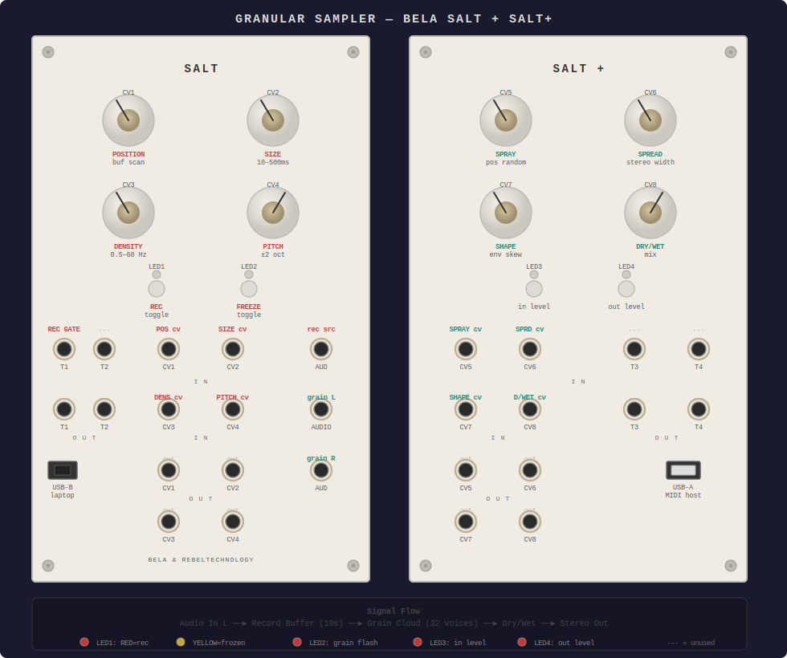

# Bela Salt Granular Sampler

A CV-controlled granular synthesis engine for the [Bela Salt + Salt+](https://learn.bela.io/products/modular/salt/) Eurorack modules.

Records audio into a 10-second circular buffer, then spawns up to 32 simultaneous grains with independent position, size, pitch, panning, and envelope shape. Every parameter is controllable via the panel knobs and CV inputs.

## Panel Layout

### Knobs (offset pots — set base value for each parameter)

| Knob | Parameter                                            | Range                          |
|------|------------------------------------------------------|--------------------------------|
| CV1  | **Position** — where in the buffer grains read from  | 0–100% of buffer               |
| CV2  | **Size** — grain duration                            | 10–500ms                       |
| CV3  | **Density** — grain spawn rate                       | 0.5–60 Hz                      |
| CV4  | **Pitch** — grain playback speed                     | ±2 octaves (center = unity)    |
| CV5  | **Spray** — random offset added to grain position    | 0 (exact) to full buffer       |
| CV6  | **Spread** — stereo width of grain placement         | 0 (mono) to 1 (full random pan)|
| CV7  | **Shape** — grain envelope attack/decay ratio        | 0 (all decay) to 1 (all attack)|
| CV8  | **Dry/Wet** — mix between input and grain output     | 0 (dry) to 1 (wet)             |

### CV Inputs

Patch CV into any of the 8 CV inputs to modulate the corresponding parameter on top of the knob's base value.

### Buttons

| Button       | Function                                                    |
|--------------|-------------------------------------------------------------|
| BTN1 (Salt)  | **Record toggle** — start/stop recording to buffer          |
| BTN2 (Salt)  | **Freeze toggle** — lock buffer contents, stop recording    |
| BTN3 (Salt+) | *(LED3: input level indicator)*                             |
| BTN4 (Salt+) | *(LED4: output level indicator)*                            |

### Trigger Input

| Jack  | Function                                                |
|-------|---------------------------------------------------------|
| T1 IN | **Record gate** — external gate to start/stop recording |

### Audio

| Jack              | Function                           |
|-------------------|------------------------------------|
| Audio IN          | Record source (mono, left channel) |
| Audio OUT         | Stereo grain mix (left)            |
| Audio OUT (row 3) | Stereo grain mix (right)           |

### LEDs

| LED  | Meaning                                          |
|------|--------------------------------------------------|
| LED1 | RED = recording, YELLOW = frozen, OFF = idle     |
| LED2 | RED flash on each grain spawn                    |
| LED3 | Input level (RED = signal, YELLOW = hot)         |
| LED4 | Output level (RED = signal, YELLOW = hot)        |

## Usage

### Deploy

1. Connect Salt to your laptop via USB
2. Open `http://bela.local` in a browser (~40s boot time, wait for heartbeat LED)
3. Create a new project in the Bela IDE
4. Drag `render.cpp` into the project
5. Click **Run**

### Perform

1. **Press BTN1** to start recording (LED1 turns red)
2. Feed audio into **Audio IN** — it records into a 10-second circular buffer
3. Grains begin spawning as soon as enough audio is recorded
4. **Twist knobs** to shape the grain cloud
5. **Press BTN2** to freeze the buffer (LED1 turns yellow) — grains now play from a static snapshot
6. **Press BTN2 again** to unfreeze and resume recording
7. **Long-press BTN4** (Salt+) or power cycle to clear the buffer

### Patch Ideas

- **Frozen texture pad**: Record a few seconds, freeze, sweep Position slowly, high Density + medium Size
- **Glitch stutter**: Short Size, high Density, no Spray — tight rhythmic granulation
- **Ambient wash**: Long Size, low Density, high Spray + Spread — diffuse stereo cloud
- **Pitch shimmer**: Pitch slightly above/below center — detuned chorus effect
- **Modulated scan**: Patch an LFO into CV1 to auto-scan through the buffer

## Technical Details

- **Language**: C++ (Bela API, C++14)
- **Sample rate**: 44.1kHz (reads from board)
- **Buffer**: 10 seconds (~1.7MB), circular
- **Max grains**: 32 simultaneous
- **Grain envelope**: Skewed raised-cosine (variable attack/decay via CV7)
- **Pitch shifting**: Variable-rate playback with linear interpolation
- **Output processing**: DC blocker + fast cubic soft clipping
- **Real-time safe**: No allocations in render(), background task for buffer clearing, fast math approximations throughout
